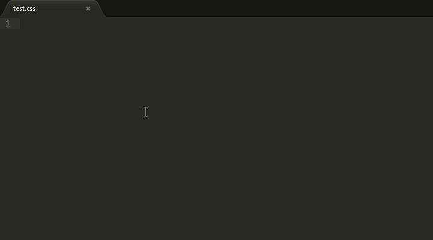

# Sublime CSS comments

Snippets of CSS comments for Sublime Text based on [Idiomatic CSS](https://github.com/necolas/idiomatic-css).

The only thing you have to do is type _comment_ in your file and the comment options will show up.

Works on `.scss`, `.sass`, `.less` and `.css` files.



## Snippets

### Basic comment

```css
/* ${1:comment} */
```

### Long description comment
```css
/*
 * ${1:comment}
 */
```

### Section comment

```css
/* ${1:comment} */
```

### Sub-section comment

```css
/* ${1:comment} */
```

## How to use

### Git

Navigate to your Sublime Text 2 snippets folder and clone the repository:

`cd path\to`

`git clone git@github.com:raphaelfabeni/cssCommentsSnippets.git`

### Manually

- Download the *.zip* file.
- Unzip the files into your Sublime Text snippets folder.
